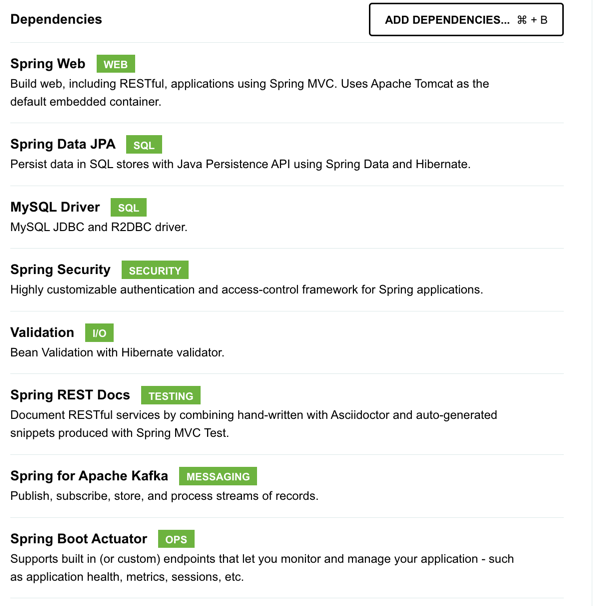

# event-storming-playground


## Microservices introduction


## Big Picture Event Storming

## Design Level Event Storming

## Coding

We start from a simple skeleton using the lastest Spring Boot version. Click [here](https://start.spring.io/starter.zip?type=maven-project&language=java&bootVersion=3.0.1&baseDir=api&groupId=playground&artifactId=api&name=api&description=Demo%20project%20for%20Spring%20Boot&packageName=playground.api&packaging=jar&javaVersion=17&dependencies=web,data-jpa,mysql,security,validation,restdocs,kafka,actuator) to download the zip.

The following dependencies are used:



### Repositories
We usually need to represent users in our applications.

Entity:

```java
@Entity
@Table(uniqueConstraints = @UniqueConstraint(columnNames = "email"))
public class MyUser {

    @Id
    @GeneratedValue
    private Long id;

    @NonNull
    private String username;

    // other fields we identified if any ...
}
```
Repository:

```java
public interface MyUserRepository extends JpaRepository<MyUser, Long> {
    
}
```
Test:
```java
@DataJpaTest
class MyUserRepositoryTest {
     private static final Logger log = LoggerFactory.getLogger(MyUserRepositoryTest.class);

    @Autowired
    MyUserRepository repository;

    @Test
    public void test() {
        repository.findAll().forEach(user -> log.info("Found user - id: {}", user.getId()));
    }
}
```
### DTOs
I can think of two reasons of using DTOs in our application.

- expose less information from our internal model. Once you provide some fields to your clients, it will be hard to remove them.
- prevent mass injection attacks

```xml

<properties>
    <java.version>17</java.version>
    <org.mapstruct.version>1.4.2.Final</org.mapstruct.version>
</properties>

<dependencies>
    <dependency>
        <groupId>org.mapstruct</groupId>
        <artifactId>mapstruct</artifactId>
        <version>${org.mapstruct.version}</version>
    </dependency>
    <!-- ... -->
</dependencies>

<plugins>
    <plugin>
        <groupId>org.apache.maven.plugins</groupId>
        <artifactId>maven-compiler-plugin</artifactId>
        <version>3.5.1</version> <!-- or newer version -->
        <configuration>
            <source>${java.version}</source> <!-- depending on your project -->
            <target>${java.version}</target> <!-- depending on your project -->
            <annotationProcessorPaths>
                <path>
                    <groupId>org.mapstruct</groupId>
                    <artifactId>mapstruct-processor</artifactId>
                    <version>${org.mapstruct.version}</version>
                </path>
                <!-- other annotation processors -->
            </annotationProcessorPaths>
            <compilerArgs>
                <arg>-parameters</arg>
            </compilerArgs>
        </configuration>
    </plugin>
</plugins>
```
Mapper:
```java
@Mapper
public interface UserDtoMapper {
    UserDtoMapper INSTANCE = Mappers.getMapper(UserDtoMapper.class);
    UserDto convert(MyUser user);
}

```

### Authentication

Activate Spring Security

```java
@Configuration
@EnableWebSecurity
@EnableMethodSecurity
public class SecurityConfiguration {

    @Bean
    public UserDetailsService userDetailsService(MyUserRepository userRepository) {
        return username -> userRepository.findByEmail(username)
                .orElseThrow(() -> new UsernameNotFoundException("User not found: " + username));
    }

    @Bean
    public PasswordEncoder passwordEncoder() {
        return PasswordEncoderFactories.createDelegatingPasswordEncoder();
    }

    @Bean
    public SecurityFilterChain securityFilterChain(HttpSecurity http) throws Exception {
       
        http
                .authorizeHttpRequests()
                .requestMatchers("/actuator/health")
                .permitAll()
                .and()
                .authorizeHttpRequests()
                .requestMatchers("/actuator/**")
                .hasRole("ADMIN")
                .and()
                .authorizeHttpRequests()
                .anyRequest().authenticated()
                .and()
                .csrf().disable()
                .httpBasic();
        return http.build();
    }
}
```

Our API has to identify the current user based on a token.

```xml
        <dependency>
            <groupId>io.jsonwebtoken</groupId>
            <artifactId>jjwt-api</artifactId>
            <version>0.11.5</version>
        </dependency>
        <dependency>
            <groupId>io.jsonwebtoken</groupId>
            <artifactId>jjwt-jackson</artifactId>
            <version>0.11.5</version>
        </dependency>
        <dependency>
            <groupId>io.jsonwebtoken</groupId>
            <artifactId>jjwt-impl</artifactId>
            <version>0.11.5</version>
        </dependency>
```
We can play around with JWTs

```java
@Component
public class JwtTokenService {
    private Clock clock = DefaultClock.INSTANCE;

    @Value("${jwt.signing.key.secret}")
    private String secret;

    @Value("${jwt.token.expiration.in.seconds}")
    private Long expiration;

    public String getUsernameFromToken(String token) {
        return getClaimFromToken(token, Claims::getSubject);
    }

    public Date getIssuedAtDateFromToken(String token) {
        return getClaimFromToken(token, Claims::getIssuedAt);
    }

    public Date getExpirationDateFromToken(String token) {
        return getClaimFromToken(token, Claims::getExpiration);
    }

    public <T> T getClaimFromToken(String token, Function<Claims, T> claimsResolver) {
        final Claims claims = getAllClaimsFromToken(token);
        return claimsResolver.apply(claims);
    }

    private Claims getAllClaimsFromToken(String token) {
        return Jwts.parser().setSigningKey(secret).parseClaimsJws(token).getBody();
    }

    private Boolean isTokenExpired(String token) {
        final Date expiration = getExpirationDateFromToken(token);
        return expiration.before(clock.now());
    }

    private Boolean ignoreTokenExpiration(String token) {
        // here you specify tokens, for that the expiration is ignored
        return false;
    }

    public String generateToken(UserDetails userDetails) {
        Map<String, Object> claims = new HashMap<>();
        return doGenerateToken(claims, userDetails.getUsername());
    }

    private String doGenerateToken(Map<String, Object> claims, String subject) {
        final Date createdDate = clock.now();
        final Date expirationDate = calculateExpirationDate(createdDate);

        return Jwts.builder().setClaims(claims).setSubject(subject).setIssuedAt(createdDate)
                .setExpiration(expirationDate).signWith(SignatureAlgorithm.HS512, secret).compact();
    }

    public Boolean canTokenBeRefreshed(String token) {
        return (!isTokenExpired(token) || ignoreTokenExpiration(token));
    }

    public String refreshToken(String token) {
        final Date createdDate = clock.now();
        final Date expirationDate = calculateExpirationDate(createdDate);

        final Claims claims = getAllClaimsFromToken(token);
        claims.setIssuedAt(createdDate);
        claims.setExpiration(expirationDate);

        return Jwts.builder().setClaims(claims).signWith(SignatureAlgorithm.HS512, secret).compact();
    }

    public Boolean validateToken(String token, UserDetails userDetails) {
        MyUser user = (MyUser) userDetails;
        final String username = getUsernameFromToken(token);
        return (username.equals(user.getUsername()) && !isTokenExpired(token));
    }

    private Date calculateExpirationDate(Date createdDate) {
        return new Date(createdDate.getTime() + expiration * 1000);
    }
}
```

Create a JWT filter using `OncePerRequestFilter`

```java
// somewhere in the filter ...
        logger.debug("JWT_TOKEN_USERNAME_VALUE '{}'", username);
        if (username != null && SecurityContextHolder.getContext().getAuthentication() == null) {

            UserDetails userDetails = this.userRepository.findByEmail(username)
                    .orElseThrow();

            if (jwtTokenService.validateToken(jwtToken, userDetails)) {
                UsernamePasswordAuthenticationToken usernamePasswordAuthenticationToken = new UsernamePasswordAuthenticationToken(userDetails, null, userDetails.getAuthorities());
                usernamePasswordAuthenticationToken.setDetails(new WebAuthenticationDetailsSource().buildDetails(request));
                SecurityContextHolder.getContext().setAuthentication(usernamePasswordAuthenticationToken);
            }
        }
```

Don't forget to add the filter in the Spring Security Config.
```java
.addFilterBefore(jwtFilter, UsernamePasswordAuthenticationFilter.class)
```

Update the properties. **Note that secret should be retrived from a keyvault or something similar.**
```text
jwt.signing.key.secret=mySecretmySecretmySecretmySecretmySecretmySecretmySecretmySecretmySecretmySecretmySecretmySecretmySecretmySecretmySecretmySecretmySecretmySecretmySecretmySecretmySecretmySecretmySecretmySecretmySecretmySecretmySecretmySecretmySecret
jwt.token.expiration.in.seconds=604800
```

Rest Controller
```java
@RestController
@RequestMapping("/api")
public class UserController {
    
    @GetMapping("/users/whoami")
    public UserDto getAuthentication(@AuthenticationPrincipal MyUser principal) {
        return UserDtoMapper.INSTANCE.convert(principal);
    }
}
```

### Publish events

To connect to kafka we need a kafka client. Therefore, we need to add a few dependencies.
```xml
<dependencies>
        <dependency>
            <groupId>org.springframework.kafka</groupId>
            <artifactId>spring-kafka</artifactId>
        </dependency>
        <dependency>
            <groupId>org.springframework.kafka</groupId>
            <artifactId>spring-kafka-test</artifactId>
            <scope>test</scope>
        </dependency>
</dependencies>
```

To send events, we can use the `KafkaTemplate` provided by spring.
```java
import org.slf4j.Logger;
import org.slf4j.LoggerFactory;
import org.springframework.kafka.core.KafkaTemplate;
import org.springframework.stereotype.Service;
import java.util.concurrent.CompletableFuture;

@Service
public class MyPublisher {
    private static final Logger log = LoggerFactory.getLogger(MyPublisher.class);
    private final KafkaTemplate<String, Object> kafkaTemplate;

    public MyPublisher(KafkaTemplate<String, Object> kafkaTemplate) {
        this.kafkaTemplate = kafkaTemplate;
    }

    public CompletableFuture<Void> sendToTopic(String message) {
        log.info("sendToTopic - message: {}", message);
        return kafkaTemplate.send("mytopic", message)
                .thenAccept(res -> {
                    log.info("sendToTopic - message: {}, done", message);
                }).exceptionally(err -> {
                    log.warn("sendToTopic - message: {}, error: {}", message, err);
                    return null;
                });
    }
}

```

We can test our service with an embedded kafka instance.
```java
package com.mih.training.invoice.events;

import org.junit.jupiter.api.Test;
import org.springframework.beans.factory.annotation.Autowired;
import org.springframework.boot.autoconfigure.kafka.KafkaAutoConfiguration;
import org.springframework.boot.test.context.SpringBootTest;
import org.springframework.kafka.test.context.EmbeddedKafka;

import java.util.concurrent.ExecutionException;

@EmbeddedKafka(topics = "mytopic")
@SpringBootTest(properties = "spring.kafka.bootstrap-servers=${spring.embedded.kafka.brokers}", classes = {MyPublisher.class, KafkaAutoConfiguration.class})
class MyPublisherTest {

    @Autowired
    MyPublisher myPublisher;

    @Test
    public void test() throws ExecutionException, InterruptedException {
        myPublisher.sendToTopic("test").get();
    }

}

```
Consume events:

```java
import org.apache.kafka.clients.consumer.ConsumerRecord;
import org.slf4j.Logger;
import org.slf4j.LoggerFactory;
import org.springframework.kafka.annotation.KafkaListener;
import org.springframework.kafka.core.KafkaTemplate;
import org.springframework.stereotype.Service;

import java.util.concurrent.CompletableFuture;

@Service
public class MyConsumer {
    private static final Logger log = LoggerFactory.getLogger(MyConsumer.class);

    @KafkaListener(groupId = "group-1", topics = "mytopic")
    public void onMessage(ConsumerRecord<String, String> message) {
        log.info("onMessage -  received message: " + message);
    }
}

```

```text
2022-12-12T14:51:32.839+02:00  INFO 7153 --- [ntainer#0-0-C-1] c.m.events.MyConsumer   : onMessage -  received message: ConsumerRecord(topic = mytopic, partition = 0, leaderEpoch = 0, offset = 0, CreateTime = 1670849477934, serialized key size = -1, serialized value size = 4, headers = RecordHeaders(headers = [], isReadOnly = false), key = null, value = test)
```

In our app create a new file named: `Dockerfile` that starts our application.

```text
FROM amazoncorretto:17-al2022-jdk

COPY target/lib /app/lib
COPY target/classes /app/classes

EXPOSE 8080 8080

ENTRYPOINT ["java", "-cp", "/app/classes:/app/lib/*", "<main-class-full-name>"]
```

Create a `Run Configuration` to start the application as a container connected to the docker sandbox.
Don't forget to add `--network sandbox_default` to allow your new container to connect to kafka.

_Depending on the folder name you used, the network may be called differently._

### Configuration

We run the application with the docker profile and use docker specific properties from `application-docker.yaml`
```yaml
spring:
  kafka:
    properties:
      schema.registry.url: http://schema-registry:8091
    producer:
      value-serializer: io.confluent.kafka.serializers.KafkaAvroSerializer
      properties:
        schema.registry.url: http://schema-registry:8091
    bootstrap-servers: kafka:9092
```

### Avro messages
We can send Avro messages from our application. To do this, instead of sending simple string payloads we switch to a new serializer.

```xml
        <dependency>
            <groupId>io.confluent</groupId>
            <artifactId>kafka-streams-avro-serde</artifactId>
            <version>${confluent.version}</version>
        </dependency>
        <dependency>
            <groupId>io.confluent</groupId>
            <artifactId>kafka-schema-registry-client</artifactId>
            <version>${confluent.version}</version>
        </dependency>
        <dependency>
            <groupId>io.confluent</groupId>
            <artifactId>kafka-avro-serializer</artifactId>
            <version>${confluent.version}</version>
        </dependency>
        <dependency>
            <groupId>org.apache.avro</groupId>
            <artifactId>avro</artifactId>
            <version>1.11.0</version>
        </dependency>

        <repositories>
        <repository>
            <id>confluent</id>
            <url>https://packages.confluent.io/maven</url>
        </repository>
        </repositories>
```

Let's create our first avro message: `src/main/resources/avro/mytopic/InvoiceEvent.avsc`

```json
{
    "doc": "Internal representation of a paid invoice",
    "type": "record",
    "name": "MyEvent",
    "namespace": "com.mih.training.invoice.events",
    "fields": [
        {
            "doc": "Invoice Number",
            "name": "invoiceNumber",
            "default": null,
            "type": [
                "null",
                "string"
            ]
        },
        {
            "doc": "Invoice Date",
            "name": "invoiceDate",
            "default": null,
            "type": [
                "null",
                "long"
            ]
        },
        {
            "doc": "Total Amount Due",
            "name": "amoundDue",
            "default": null,
            "type": [
                "null",
                "double"
            ]
        }
    ]
}

```
To be able to use Java classes created from the avro files, we can use a plugin
```xml

<plugins>
        <plugin>
        <groupId>org.apache.avro</groupId>
        <artifactId>avro-maven-plugin</artifactId>
        <version>1.9.0</version>
        <executions>
            <execution>
                <phase>pre-clean</phase>
                <goals>
                    <goal>schema</goal>
                </goals>
                <configuration>
                    <sourceDirectory>${project.basedir}/src/main/resources/avro</sourceDirectory>
                    <includes>
                        <include>**/*.avsc</include>
                    </includes>
                    <outputDirectory>${project.basedir}/src/main/java</outputDirectory>
                    <imports>
                        <import>
                            ${project.basedir}/src/main/resources/avro/mytopic/InvoiceEvent.avsc
                        </import>
                    </imports>
                    <stringType>String</stringType>
                </configuration>
            </execution>
        </executions>
        </plugin>
</plugins>
```

Run `mvn clean install`.

Check `com.mih.training.invoice.events.InvoiceEvent` was generated.

Update publisher and consumer with the new payload type.
